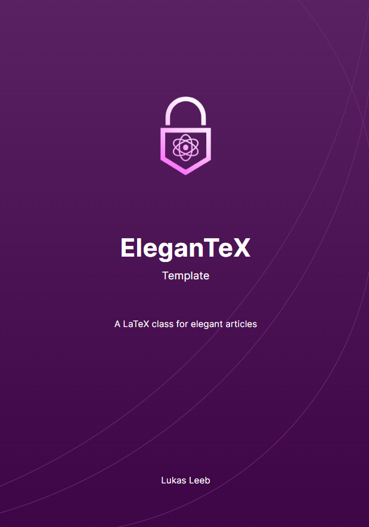

# elegantex

<div align="center">
    
</div>

## Motivation

This LaTeX template was initially created for my diploma thesis at [HTL Spengergasse](https://spengergasse.at/). Due to the good feedback from my teachers and other colleagues, I decided to make it publicly available.

## Setup

### Git Setup

If you use LaTeX inside of a Git repository, it is recommended to add this repository as a Git submodule:

```bash
git submodule add https://github.com/lukasl-dev/elegantex
```

### Manual Setup

You can use it manually by creating a `elegantex` directory and move the `elegantex.cls` file into it:

```bash
> tree
.
├── elegantex
│   └── elegantex.cls
└── main.tex

2 directories, 2 files
```

> You probably want to go for the manual approach when you want to customise the template.

## Usage

This template can be used as document class inside of your `.tex` file:

```tex
\documentclass{elegantex/elegantex}
```

After declaring the document class, you can define the following parameters:

```tex
\title{EleganTeX}
\subtitle{Template}
\author{Lukas Leeb}
\slogan{A LaTeX class for elegant articles}
\logo{logo_transparent.png}
```

### Title Page

The regular `\maketitle` LaTeX command is overriden by the template. You can use it inside of your document body:

```tex
\begin{document}
    \maketitle
    
    \section{History}

    A brief history of time...
\end{document}
```

## Full Example

```tex
\documentclass{elegantex/elegantex}

\title{EleganTeX} % required
\subtitle{Template} % optional
\author{Lukas Leeb} % optional
\slogan{A LaTeX class for elegant articles} % optional
\logo{logo_transparent.png} % optional

\begin{document}
    \maketitle

    \tableofcontents
    \newpage

    \section{Introduction}

    Some introduction text...
\end{document}
```
